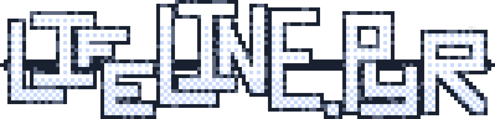
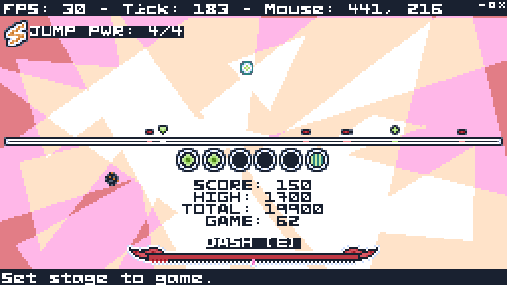
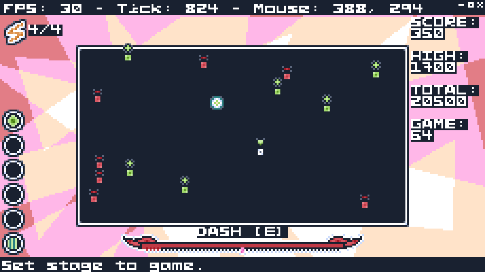

  
  
  
  
   
	Lifeline.PYR is a retro-style arcade game where you try and keep your constantly decreasing life down with constricted movement. 
  <a href="https://jasperredis.github.io/Lifeline.PYR">Website</a> |
  <a href="https://jris.straw.page">jasperredis</a> 

  
 

# Gameplay
> See the "HOW TO PLAY" menu on the title screen for more details.

### Core Gameplay
You are on a line (*or in a rectangle, if in the 2D gamemode*) and can move left and right (*or left, right, up, and down, if in the 2D gamemode*). Your health starts at five and is constantly decreasing.

Heals and enemies randomly spawn. Heals give you one health point while enemies take one away.

 Your goal is to stay alive for the longest amount of time that you can.
 
 There are also other mechanics, such as:

- Jumping (*a two-second invincibility frame that takes ten seconds to recharge, but you also can't get heals while using it (don't worry you can stop a jump by pressing [S])*)
- Dashing (*self-explanatory*)
- Power-ups (*fall from the top of the screen and help you, are more common when you need them because of a deliberate mechanic i call "urgency"*)
- Hazards (*also fall from the top of the screen but they don't really help you*)
- Lasers (*strike you from the sky (with a warning), do not touch them*)

# Licensing
Different parts of this project are under different licenses.

- **Game Source Code:** [GNU General Public License v3.0 (*GPLv3*)](https://www.gnu.org/licenses/gpl-3.0.en.html)
- **Game Assets:** [Creative Commons Attribution-ShareAlike 4.0 International (*CC BY-SA*)](https://creativecommons.org/licenses/by-sa/4.0/legalcode.en)
- **PYRFont5x5:** [SIL Open Font License Version 1.1 (*OFL*)](https://openfontlicense.org/open-font-license-official-text/)
- **Website:** [MIT License](https://opensource.org/license/MIT)

Be warned: A lot of this code could have been better. I have worked on this project for a *very* long time, and over that time I have gotten a lot better at programming. This game could see a refactor, but that would be an ambitious thing to do. Contributions are greatly appreciated. <3
